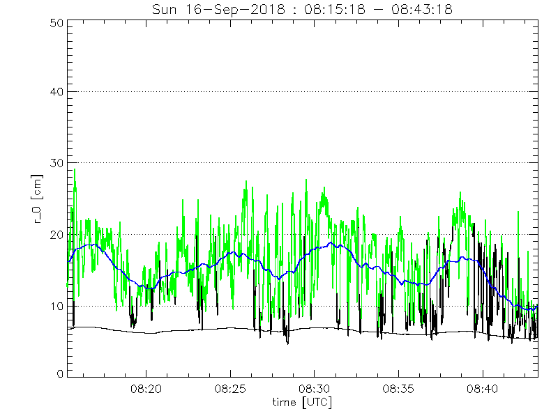

## Events of the day

* 05:00 Arrived at the telescope
* 07:10 Opened telescope
* 07:35 LRE/HRE calibration at disk-centre:

CRISP |	Fe I  6301 Å | Ca II 8542 Å | H alpha 6563 Å
----- | ------------ | ------------ | --------------
LRE   | 18028 | 24002 | 24322
HRE   | 19426 | 23006 | 24109

* 08:00 R0 looking good, starting observation! CRISP: spicules A, PIG coordinates: [-10, 950]. mu=0.21
* 08:21 Seeing getting worse, stopping
* 12:30 CHROMIS NB Flats: "Flats_70", repeats 20
* 13:13 CHROMIS WB flats" "Flats_WB_70", repeats 20
* 14:17 CRISP wb flats
* 14:21 6301 Pinholes
* 14:21 8542 Pinholes
* 14:21 CHROMIS Pinholes
* 14:25 **CRASHED**. Repeating CHROMIS Pinholes.
* 17:27 mvdata : CHROMIS 2 TB, CRISP 1.2 TB

## Data transfer

From camera machines to `transport7:/data/disk7` :
* CRISP: from obs@royac: `mvdata /data/disk7 /data/ITA/2018.09.10`
* CHROMIS: from obs@royac do: `mvdata /data/disk7 /data/CHROMIS/2018.09.10`
*(note -P option if you do not want the camera computers to switch off after transfer completion)*

From transport1:/data/disk1 to Oslo:
* CRISP: from `/data/disk7/ITA`: `../../mvoslo 2018.09.10`
* CHROMIS: from `/data/disk7/CHROMIS`: `../../mvoslo_d2 2018.09.10`
